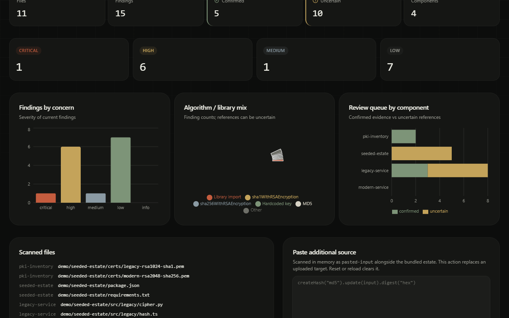
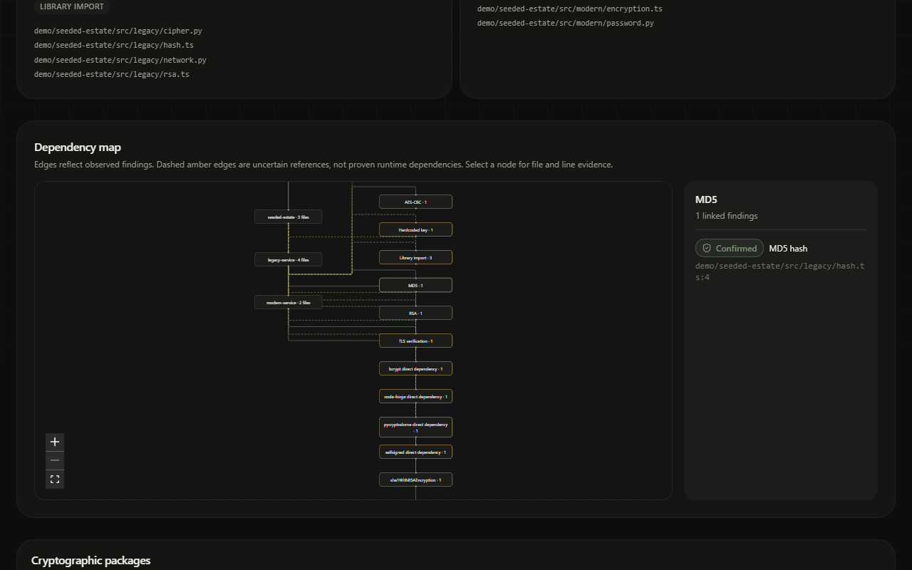
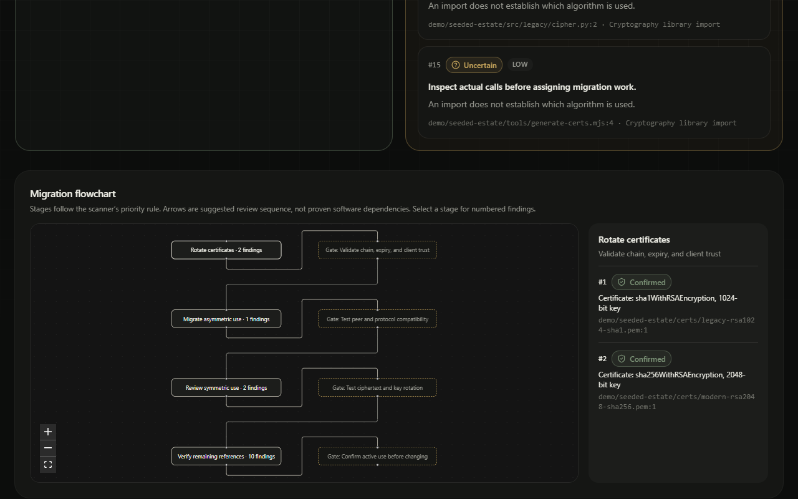

# Lattice — crypto migration scanner

Lattice inventories cryptography in source files, configuration, direct dependency manifests, and PEM-formatted certificates. It turns file-backed evidence into a prioritized migration checklist, an interactive component map, and an exportable report. A separate sandbox runs classical, post-quantum, and hybrid cryptographic providers using established libraries.

**Problem:** teams planning a post-quantum transition need to find where cryptography is used, distinguish direct evidence from weak signals, and order migration and compatibility work. This tool supports that first inventory step. **A scan does not prove a system is quantum-safe.**

## See the running demo







The bundled `demo/seeded-estate/` contains deliberately weak and modern source examples, manifests, and real PEM certificates. On this fixture, the app reports **11 files, 15 findings, 5 confirmed, 10 uncertain**. These counts are from the current fixture, not hardcoded findings.

## What each requirement does

| Requirement | Implementation |
| --- | --- |
| Scan a provided repository and configs | **Scan target** accepts a local folder, ZIP, loose source/config/PEM files, or a public GitHub repository URL. The CLI accepts a local folder. |
| File and line classification | Findings carry source path, line, usage, migration concern, severity, and confidence. `confirmed` is limited to a direct algorithm call or parsed certificate field; dependency, wrapper, and config hints are `uncertain`. |
| Dependency inventory | Direct `package.json` and `requirements.txt` entries are compared with a fixed package table. The inventory and graph link components to observed mechanisms; graph edges are evidence links, not proven runtime calls. |
| Prioritized checklist | Confirmed and uncertain actions are separate. The sort prioritizes asymmetric findings, then certificate expiry, then internet-facing paths. The flowchart shows suggested validation gates. |
| Crypto-agility sandbox | Classical runs P-256 ECDH/ECDSA and AES-GCM via Web Crypto. Post-quantum runs `ml_kem768` and `ml_dsa65` via `@noble/post-quantum`. Hybrid runs that library's X-Wing KEM with separate signature checks. Results show sizes and pass/fail, never raw shared secrets. |
| Report | **Download report** exports Markdown from the current scan with findings, compatibility risks, testing steps, limitations, and the explicit quantum-safety disclaimer. |

The overview's three charts use live scan counts. Wrapper/package hints are bounded to the fixed direct-dependency table. The hybrid sandbox is an interoperability demonstration, not a certified deployment. The migration arrows show recommended review order; the scanner does not infer a software call graph.

The optional [GitHub workflow](.github/workflows/crypto-ci.yml) compares scanner JSON for the current and base revisions, annotates new dependency/config references, and fails on newly introduced high-severity config or protocol references. It comments on same-repository PRs with new findings. This workflow is present locally; a hosted GitHub Actions run has not been verified for this revision.

## Run locally

Requires Node.js 22 or newer, npm, and Git for GitHub URL scans. No .NET SDK is used.

```powershell
npm ci
npm run dev
```

Open the URL printed by the dev server. To run the same scanner without the UI:

```powershell
npm run --silent scan -- demo/seeded-estate
```

The CLI writes `ScanResult` JSON to stdout. Other useful checks:

```powershell
npm test
npm run typecheck
npm run build
node scripts/verify-submission.mjs
```

`verify-submission.mjs` drives local Chrome, tests folder and ZIP scans, graph evidence clicks, Markdown download, and desktop/mobile screenshots. It expects the dev server to be running.

## Input and confidence limits

- Uploads are scanned in memory; a GitHub URL makes a shallow server-side clone in a temporary directory and removes it after scanning. Public `github.com` HTTPS repositories only. Hosted Git clone support depends on Git and outbound network access in the host environment; hosted deployment has not been verified.
- Upload limits are 200 supported files, 1 MiB per file, 3 MiB total. Unsupported and ignored files are skipped. `.crt` is supported when it contains a PEM certificate; DER certificates are not parsed.
- The scanner uses selected static patterns and a small direct-dependency table. It does not prove active runtime use, inspect all languages or transitive packages, validate certificate trust chains, or cover HSMs and managed services.
- `confirmed` describes the evidence type, not production exploitability or quantum readiness. A passing sandbox run also does not prove interoperability or compliance.

## Stack

TypeScript, React 19, TanStack Start, Vite 8, Tailwind CSS 4, Recharts, React Flow (`@xyflow/react`), `node-forge` for certificate parsing, and `@noble/post-quantum` for the PQC sandbox. The seeded estate is bundled into the server build. Source: [`demo/seeded-estate/`](demo/seeded-estate/). Judge flow: [`docs/demo-script.md`](docs/demo-script.md).

## Known issues

**known Windows issue:** If `npm run dev` fails, run `node scripts/with-app-env.mjs node node_modules/vite/bin/vite.js dev --host 0.0.0.0 --port 8080` from the repo root; if port 8080 is occupied, stop that server or choose a free port.
